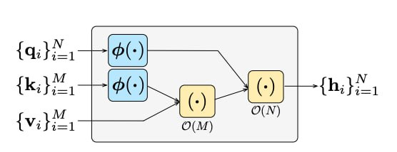
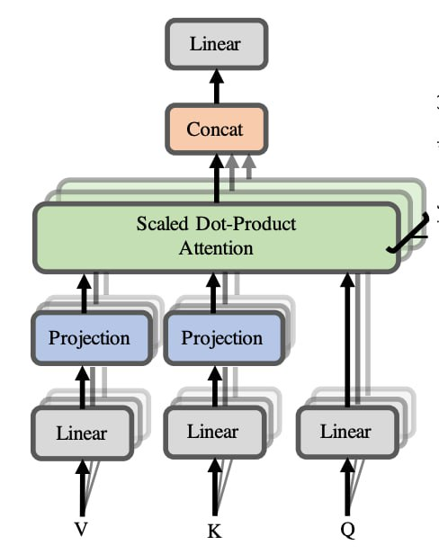
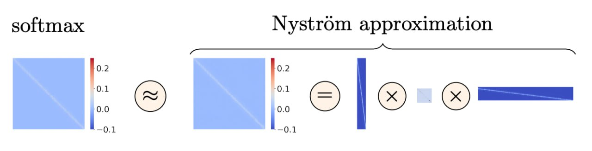
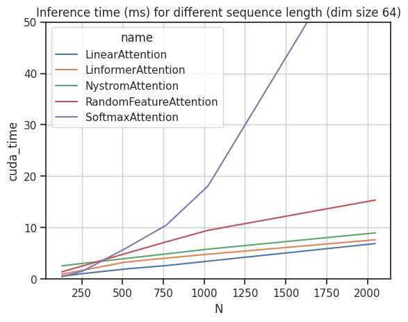
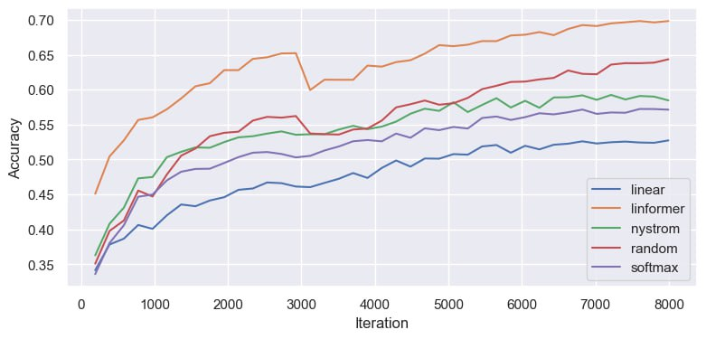

<!-- paginate: true -->

## Optimization of the Transformer’s attention

##### Linear Algebra (1.22-23.PKN22/M)

Andrii Ruda
Anton Brazhniy
Oleksandr Korniienko

---

# Project goals

1. Investigate method of imrovement for dot-product (softmax) attention.
2. Implement and evaluate method on CIFAR-10 image classification benchmark.

<!-- footer: CIFAR-10 banchmark: Learning multiple layers of features from tiny images. Technical report, University of Toronto, 2009 \n Image source: https://arxiv.org/abs/1706.03762 \n\n Andrii Ruda, Anton Brazhniy, Oleksandr Korniienko -->
---

## [Attention Is All You Need](https://arxiv.org/abs/1706.03762)

$\text{Attention}(Q, K, V) = \text{softmax}(\frac{QK^T}{\sqrt{d_k}})V$

$
X \in R^{batch \times tokens \times d_k}, Q = XW^Q, K = XW^K, V = XW^V
$

- $d_{model}$ is the size of the embedding vector of each input element from our
sequence.
- $d_k$ is the inner dimension of that is specific to each self-attention layer.
- $batch$ is the batch size
- $tokens$ is the number of elements that our sequence has, e.g. number of pixels.

<!-- footer: Source: https://theaisummer.com/self-attention\n\nAndrii Ruda, Anton Brazhniy, Oleksandr Korniienko -->
---
<!-- _style: |
  p { columns: 2; }
-->
# Kernel-based attention optimization methods

### Random feature attention (RFA)

$
\text{RFA}(Q, K, V) =\text{Softmax} \big( \frac{QK^T}{\sqrt{d_k}} \big)V \approx \\
\approx \frac{ \phi(q)^T \sum_{i}\phi(k_i) \otimes v_i }{ \phi(q) \cdot \sum_{j} \phi(k) }
$

<!-- footer: Andrii Ruda, Anton Brazhniy, Oleksandr Korniienko -->

---

# Low-rank attention optimization methods
## Linear Attention

$\text{Linear Attention}(Q, K, V) = \\ =  \big( \frac{Q}{\sqrt(d_k)} \big) \big( \frac{K^T}{\sqrt(d_k)} V ) = \\ = \frac{1}{d_k} Q \big( K^T V \big) =  \frac{1}{d_k} \big(Q K^T\big) V = \\ = \text{Attention}(Q, K, V)$

---

# Low-rank attention optimization methods
## Linformer Attention

$\text{Linformer}(Q, K, V) = \\ = \text{Softmax} \big( \frac{QK^T}{\sqrt{d_k}} \big)V   \approx \\ \approx \text{Softmax} \big( \frac{Q \big(EK\big)^T}{\sqrt{d_k}} \big) \big(FV\big)$

---

# Low-rank attention optimization methods

## Nystrom Attention

###### $\text{Attention}(Q, K, V) = \text{softmax}(\frac{QK^T}{\sqrt{d_q}})V = \begin{bmatrix} {A_S} & {B_S} \\{F_S} & {C_S}\end{bmatrix}$

###### $\hat{\text{Nystrom Attention(Q, K,V)}} = [\text{softmax}(\frac{Q\tilde{K}^T}{\sqrt{d_q}}) (\text{softmax}(\frac{\tilde{Q}\tilde{K}^T}{\sqrt{d_q}}))^{\dagger} \text{softmax}(\frac{\tilde{Q}{K}^T}{\sqrt{d_q}})]V$

---

# Attention Complexity

---

# Attention Complexity

| Method                                 | Computational    | Memory             |
| -------------------------------------- | ---------------- | ------------------ |
| Dot-product (softmax) attention        | $O(d^2n + dn^2)$ | $O(nd^2)$          |
| Linear attention                       | $O(d^2n)$        | $O(dn + d^2)$      |
| Linformer Attention                    | $O(n)$           | $O(n)$             |
| Random Feature Attention               | $O(nd)$          | $O(4D + 2Dd)$      |
| Nystrom Attention                      | $O(n)$           | $O(n)$             |

---

# Attention accuracy

---

# Conclusions

- Investigated dot-product attention mechanism optimization using **linear algebra** matrix transformation techniques.
- Empirically demonstrated that linear attention approach has lower computational complexity than observed methods.
- Linformer attention mechanism showed best classification accuracy among observer models with similar hyper-parameter sets.

---
<!--fit-->

Thanks for your attention!

