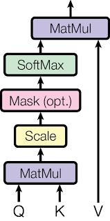

<!-- paginate: true -->

## Optimization of the Transformer’s attention

##### Linear Algebra (1.22-23.PKN22/M)

Andrii Ruda
Anton Brazhniy
Oleksandr Korniienko


---

# Project goals

1. Investigate method of imrovement for dot-product attention.
2. Implement and evaluate method on CIFAR-10 image classification benchmark.



<!-- footer: CIFAR-10 banchmark: Learning multiple layers of features from tiny images. Technical report, University of Toronto, 2009 \n Image source: https://arxiv.org/abs/1706.03762 \n\n Andrii Ruda, Anton Brazhniy, Oleksandr Korniienko -->
---

## [Attention Is All You Need](https://arxiv.org/abs/1706.03762)

$\text{Attention}(Q, K, V) = \text{softmax}(\frac{QK^T}{\sqrt{d_k}})V$

$
X \in R^{batch \times tokens \times d_k}, Q = XW^Q, K = XW^K, V = XW^V
$

- $d_{model}$ is the size of the embedding vector of each input element from our
sequence.
- $d_k$ is the inner dimension of that is specific to each self-attention layer.
- $batch$ is the batch size
- $tokens$ is the number of elements that our sequence has, e.g. number of pixels.

<!-- footer: Source: https://theaisummer.com/self-attention\n\nAndrii Ruda, Anton Brazhniy, Oleksandr Korniienko -->
---
<!-- _style: |
  p { columns: 2; }
-->
# Kernel-based attention optimization methods

## Random feature attention

$
P =\text{Softmax} \big( \frac{QK^T}{\sqrt{d_k}} \big) \approx  
\frac{ \phi(q)^T \sum_{i}\phi(k_i) \otimes v_i }{ \phi(q) \cdot \sum_{j} \phi(k) }
$

<!-- footer: Andrii Ruda, Anton Brazhniy, Oleksandr Korniienko -->
---

# Low-rank attention optimization methods


<div class="grid grid-cols-2 gap-4">
<div>


</div>
<div>

## Column 2

Tempore ad exercitationem necessitatibus nulla, optio distinctio illo non similique? Laborum dolor odio, ipsam incidunt corrupti quia nemo quo exercitationem adipisci quidem nesciunt deserunt repellendus inventore deleniti reprehenderit at earum.

</div>
</div>

---

# Attention Complexity

| Method                                 | CC  | MC              | $MC,N=32\times32,D=32$        |
| -------------------------------------- | ----| ----------------| ----------------------------- |
| Dot-product attention Linear attention | ... | $O(n^2)$        | $2^{20}$                      |
| Linear attention                       | ... | $O(dn + d^2)$   | $2^{11}$                      |
| Linformer Attention                    | ... | $O(n)$          | $2^{10}$                      |
| Random Feature Attention               | ... | $O(4D + 2Dd)$   | $2^{12}$                      |
| Nystrom Attention                      | ... | $O(n)$          | $2^{10}$                      |

---

# Attention accuracy

---

# Conclusions

<!-- 1. Use jsonPath to filter products: 
   ```$.[?(@.category=='{{product_type}}')].price```
   Result: ```[150, 40]```
1. Replace comma with plus ```[150+ 40]```
2. Replace brakets with spaces ```150 + 40```
3. Use math endpoint to get the sum ```190.0```


---

demo & possible improvements

---

### task 2

how to get a time diff?

hint:
```js
POST /api/v1/utils/datetime/now

{
  "timeZone" : "UTC",
  "outputFormat" : "EPOCH"
}
```

---

the docs are available here
https://common.botscrew.net/

---

the future of common.botscrew.net

1. mapping the data to messages (generic, images etc.)
2. introduce ```functions``` — predefined api calls
3. add sequencing (to avoid a lot of API calls)

---

## <!--fit thanks

### time for q&a 
-->
